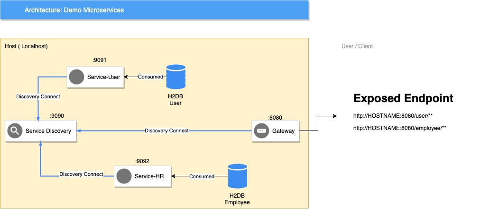

# spring-microservices
A demo for spring microservices using Eureka Registry

This project contains:
1. Service-User -> Service for user
2. Service-HR -> Employee data
3. Service-Registry -> Spring Boot Eureka Registry
4. core-library -> Core, helper, base

# Architecture

# How to run
To run this service, make sure service-registry has been started, to do that use:

    gradle service-registry:bootRun
 
Then you can run other service like:
service-user

    gradle service-user:bootRun

service-hr

    gradle service-user:bootRun

# Service Mapping
This project preconfigured with this mapping:

service-registry -> http://127.0.0.1:9090/eureka

service-user ->  http://127.0.0.1:9091

service-hr ->  http://127.0.0.1:9092

service-gateway ->  http://127.0.0.1:8080 ( Published endpoint at /user/** /employee/** )
